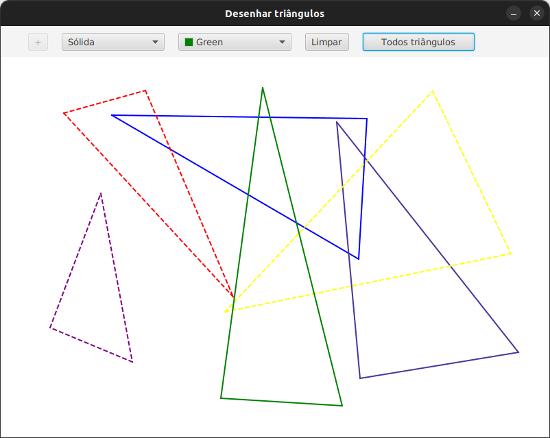

# Triângulos

Aplicativo escrito em Java para apresentar a biblioteca [JavaFX](https://openjfx.io/) e alguns dos seus recursos. Ele foi construído utilizando arquivos `.fxml` para definir os elementos da interface gráfica e uma classe *Controller* para gerenciar tais elementos.

